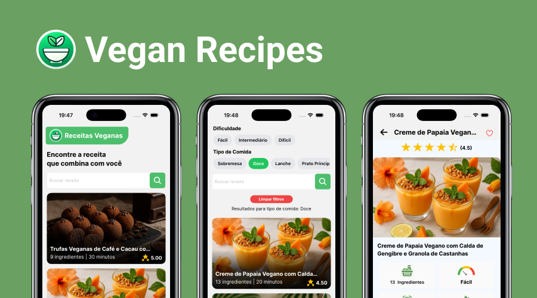

<h1 align="center">
  
</h1>

<p align="center">
  <a href="#features">Features</a>&nbsp;&nbsp;&nbsp;|&nbsp;&nbsp;&nbsp;
  <a href="#technologies">Technologies</a>&nbsp;&nbsp;&nbsp;|&nbsp;&nbsp;&nbsp;
  <a href="#getting-started">Getting started</a>&nbsp;&nbsp;&nbsp;|&nbsp;&nbsp;&nbsp;
  <a href="#project">Project</a>&nbsp;&nbsp;&nbsp;|&nbsp;&nbsp;&nbsp;
  <a href="#test-coverage">Test Coverage</a>&nbsp;&nbsp;&nbsp;|&nbsp;&nbsp;&nbsp;
  <a href="#application">Application</a>
</p>

<br>

<p align="center">
  
</p>

---

## Features

- [x] Browse a wide range of recipes with detailed information
- [x] Follow step-by-step instructions for each recipe
- [x] Mark recipes as favorites to save them for later
- [x] Search recipes by name, difficulty, or category
- [x] Access your saved favorites offline
- [ ] Rate and provide feedback on recipes

## Technologies

This project was developed using the following technologies:

- [React Native](https://reactnative.dev/)
- [Expo bare workflow](https://expo.io/)
- [TypeScript](https://www.typescriptlang.org/)
- [TanStack Query](https://tanstack.com/query/latest)
- [NativeWind](https://www.nativewind.dev)

## Getting started

Clone the project and access the folder

```bash
$ git clone https://github.com/HelvioFilho/vegan-recipes && cd vegan-recipes
```

Follow the steps below

```bash
# Install the dependencies
$ npm install

# Create the ios and android folders
$ npx expo prebuild

# Start the project
# Android
$ npx expo android

# IOS
$ npx expo ios
```

## Project

Vegan Recipes
Discover the joy of plant-based cooking with Vegan Recipes, your ultimate guide to embracing a vegan lifestyle. This app offers a curated collection of delicious, easy-to-follow vegan recipes, designed to inspire both beginners and seasoned vegans. From quick meals to gourmet dishes, find everything you need to make your vegan journey flavorful and fulfilling. Whether you're exploring veganism for health, ethics, or the environment, Vegan Recipes is here to support you every step of the way.

Download now and start cooking up a healthier, kinder world!

## Test Coverage

Check out our test coverage:

[](https://codecov.io/gh/HelvioFilho/vegan-recipes)

Here you can view detailed information on how much of our code is covered by automated tests. This helps us ensure the quality and reliability of the application as it grows.

## Application

The application is in beta testing and will soon be available for all users to download on Google Play.

<a href="https://play.google.com/store/apps/details?id=com.hsvf.veganrecipes">
  
</a>
